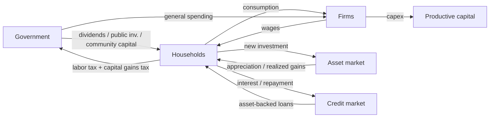

# Circular Capitalism Simulator

**An open-source laboratory for testing how capital-gains tax deferral, asset-backed liquidity, and recirculation policies affect wealth concentration and economic performance.**

[](https://github.com/BlueGarfield/circular-capitalism-sim/actions/workflows/tests.yml)
[](https://github.com/BlueGarfield/circular-capitalism-sim/actions/workflows/lint.yml)
[](LICENSE)
[](pyproject.toml)

---

## Research question

> How does persistent tax deferral on unrealized asset gains affect long-run
> wealth concentration, capital circulation, median household wealth,
> investment formation, government revenue, and economic output?

## What "Circular Capitalism" means in this project

The **Circular Capitalism hypothesis**: capitalism may perform better when
the system preserves strong incentives for private wealth creation and
productive investment **while** preventing indefinite tax deferral from
becoming a self-reinforcing mechanism for permanent capital concentration.

This repository treats that as a **hypothesis to test, not a conclusion**.
The model is explicitly capable of producing results that support, weaken,
or contradict it depending on assumptions and parameters — including
behavioral channels (investment tax elasticity, weak public-investment
productivity) under which the Circular Capitalism regime *underperforms*.

## Model architecture

Two engines share one monthly period specification:

- **Mesa 3.x ABM engine** — transparent per-agent behavior (households,
  firms, government) with explicit staged AgentSet activation. No legacy
  schedulers.
- **Vectorized reference engine** — NumPy implementation for fast Monte
  Carlo and sensitivity analysis, instrumented with per-period
  **accounting-invariant checks**: taxes paid = revenue received, transfers
  distributed = transfers received, borrowing/debt and repayment
  consistency, asset and cost-basis stock-flow identities, and a fully
  traceable government budget. No silent money creation — asset
  appreciation is the only source of new nominal wealth and it is exposed as
  an explicit variable.



## The four scenarios

| # | Scenario | Key mechanics |
|---|---|---|
| 0 | **Control** | High realization probability; gains enter the tax base regularly; no borrowing advantage, no recirculation |
| 1 | **Persistent Deferral** | Gains taxed only on realization; low realization probability; unrealized gains compound untaxed |
| 2 | **Deferral + Asset-Backed Liquidity** | Adds collateralized borrowing (LTV, rate, threshold); **borrowing is never a realization event** |
| 3 | **Circular Capitalism** | Adds maximum deferral period, deemed-realization threshold, citizen dividend, public + community investment — **with behavioral responses enabled so the regime can underperform** |

## KPI definitions

Full definitions with edge cases: [docs/kpis.md](docs/kpis.md). Highlights:

- **Wealth Gini**, **Top 10% / 1% / 0.1% shares**, **Median wealth**
- **Deferred Wealth Stock**: `DWS_t = Σ max(unrealized_gains_i, 0)`
- **Deferred Wealth Concentration**: top-1% share of unrealized gains
- **Effective Economic Tax Rate**: `taxes / (labor + realized + unrealized gains)` — a project-specific analytical metric, **not** a statutory rate
- **Capital Recirculation Rate**: circulating flows / total economic income
- **Recirculation Gap**: `Δwealth − (labor income + realized gains)`

## Installation

```bash
git clone https://github.com/BlueGarfield/circular-capitalism-sim.git
cd circular-capitalism-sim
python -m venv .venv && source .venv/bin/activate
pip install -e ".[dev]"      # or: pip install -e ".[dashboard]"
```

Requires Python 3.12+.

## Quick start

```bash
# Run one scenario (vectorized engine) with invariant checks
ccsim scenarios/01_persistent_deferral.yaml --check-invariants

# Same scenario on the Mesa ABM engine
ccsim scenarios/01_persistent_deferral.yaml --engine mesa

# Compare in Python
python -c "
from circular_capitalism import run
r = run('scenarios/03_circular_capitalism.yaml')
print(r.summary())"
```

## Dashboard

```bash
pip install -e ".[dashboard]"
streamlit run dashboard/app.py
```

KPI cards, scenario comparison charts (top-1% share, median wealth, Gini,
deferred wealth stock, recirculation gap, productive investment, revenue by
source, borrowing by cohort), scenario selectors, and policy sliders. Chart
scales are never manipulated to exaggerate differences.

## Web companions

The dependency-free Chart Lab and Society View are in `web/`. Run them
locally with:

```bash
python -m http.server 8000 --directory web
```

For GitHub Pages, complete the repository's one-time setup before running the
`pages` workflow:

1. Open **Settings > Pages**.
2. Under **Build and deployment**, set **Source** to **GitHub Actions**.
3. Open **Actions > pages** and run the workflow.

The workflow verifies this prerequisite and returns an actionable error if
Pages has not been configured. The repository `GITHUB_TOKEN` cannot create the
initial Pages site on its own.

## Batch simulation (Monte Carlo)

```bash
# 50 seeds; reports mean/median/std, 5–95% bands, 95% CI of the mean
ccsim-batch scenarios/01_persistent_deferral.yaml --runs 50

# One-at-a-time sensitivity sweep with MC replication per grid point
ccsim-sensitivity scenarios/03_circular_capitalism.yaml \
    --param policy.capital_gains_tax_rate \
    --values 0.0,0.1,0.2,0.3,0.4 --runs 10
```

**A single seed is never evidence.** All distributional claims must come
from the batch runner.

## Example outputs

Running the quick-start commands writes CSV time series and JSON summaries
to `outputs/`. Illustrative structural behaviors verified by the test suite
(synthetic, uncalibrated — see disclaimer below):

- Scenario 1 accumulates a strictly larger **Deferred Wealth Stock** than
  Scenario 0, isolating the value of tax timing.
- Scenario 2 adds household debt and liquidity with **zero** additional
  capital-gains tax — the buy-borrow channel.
- Scenario 3's deferral cap and threshold produce deemed realizations and
  revenue, and its behavioral channels can reduce capital formation.

## Methodology disclaimer

This is a **controlled computational experiment**, not an empirical model of
any real economy. See [docs/methodology.md](docs/methodology.md),
[docs/assumptions.md](docs/assumptions.md), and the white paper draft at
[paper/whitepaper.md](paper/whitepaper.md).

## What This Model Does Not Prove

An agent-based model is a laboratory for exploring the logical consequences
of explicit assumptions. **Until calibrated and validated against cited
empirical data** (see [docs/calibration.md](docs/calibration.md)), outputs
from this repository:

- are **not** empirical findings about the United States or any economy;
- are **not** causal evidence for or against any real-world tax policy;
- must **not** be quoted as estimates of revenue, inequality, or growth
  effects;
- reflect stylized parameters that are documented as stylized, and results
  can reverse under different plausible assumptions.

The model is deliberately falsifiable: behavioral channels exist under which
the Circular Capitalism regime underperforms, and the test suite enforces
that those channels work.

## Current limitations

Single asset class; no inflation; flat tax rates; no estate/step-up-at-death
channel; no labor-supply response; simple firm sector; uncalibrated stylized
parameters; reduced-form behavioral elasticities. Full list:
[docs/methodology.md](docs/methodology.md#known-simplifications-v01).

## Research roadmap

[docs/roadmap.md](docs/roadmap.md) — v0.2 targets empirical calibration
(SCF, DFA, IRS SOI, CBO, BEA/BLS/Census, peer-reviewed elasticity
literature), large Monte Carlo experiments with uncertainty bands, global
sensitivity analysis, and estimation of the **Circular Capitalism efficient
frontier** across output, median wealth, capital formation, recirculation,
concentration, and revenue.

## How to contribute

See [CONTRIBUTING.md](CONTRIBUTING.md). New assumptions must be documented;
stylized parameters must never be presented as empirical facts; PRs that
hard-code policy conclusions will not be merged. Code of conduct:
[CODE_OF_CONDUCT.md](CODE_OF_CONDUCT.md).

## Citation

See [CITATION.cff](CITATION.cff). Example:

> Berba, A. J. (2026). *Circular Capitalism Simulator* (v0.1.1) [Computer
> software]. https://github.com/BlueGarfield/circular-capitalism-sim

## License

[Apache License 2.0](LICENSE) — permissive commercial and research reuse
with an explicit patent grant.
